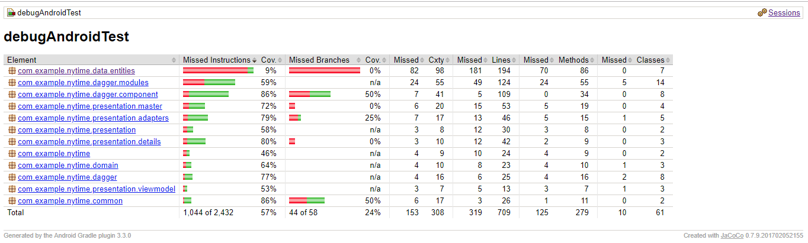
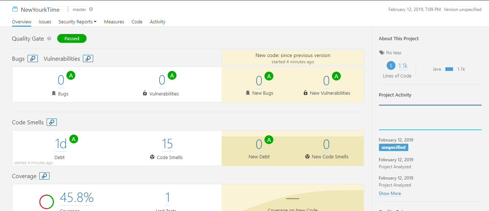
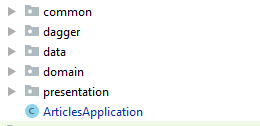

# NY-Times-Most-Popular

    
  

  
  

# How to use ?
- You need to provide your  [API key](https://developer.nytimes.com/get-started) in [build.gradle](https://github.com/setcontentviews/NY-Times-Most-Popular/blob/master/app/build.gradle)  

## Technical Notes:

Using Java programming language  for Applying MVVM architecture with the following topics  
- Test-driven development ( Junit-espresso)
- Dagger2- RxJava2
- ViewModels-LiveData

## Code Coverage
A coverage report can be generated using `gradlew createDebugCoverageReport`command-line via Gradle
Then you can find it at  `app\build\reports\coverage\debug\index.html` 

## [SonarQube Report](https://www.sonarqube.org/) 
For the code showing its quality summary can be generated  by writing a set of commands 
 
 1- `gradlew sonarqube` 
 
 2- `gradlew sonarqubegradlew clean test jacocoTestReport sonarqube -Dsonar.host.url=http://localhost:9000 — info -stacktrace` 

## Project Description

I would like to show how I made the packages structure of the project For achieving The separation of concerns 

- ## Presentation layer 
    Include normal Activities , Fragments and ViewModels which will only handle rendering views
    
- ## Domain layer 
    With the Use Cases that  will include all business logic and interact between Data and Presentation layer
    
    
- ##  Data layer 
    With the Repositories.

### Used libraries: ###
- [RxJava2](https://github.com/ReactiveX/RxJava)
- [RxAndroid](https://github.com/ReactiveX/RxAndroid)
- [Retrofit2](https://github.com/square/retrofit)
- [Android architecture components](https://developer.android.com/topic/libraries/architecture/index.html)
- [OkHttp](https://github.com/square/okhttp)
- [Picasso](https://github.com/square/picasso)
- [butterknife](http://jakewharton.github.io/butterknife/)

